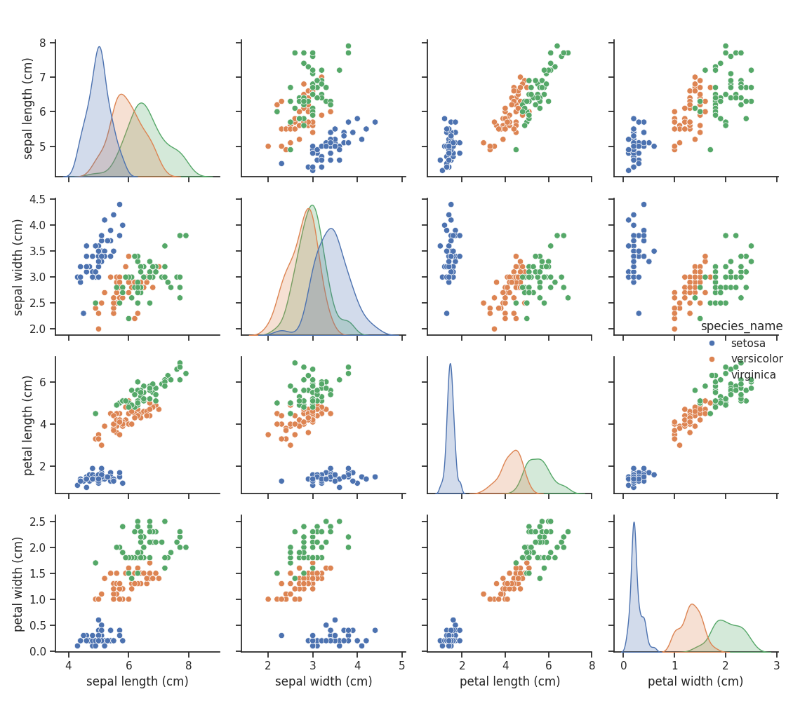
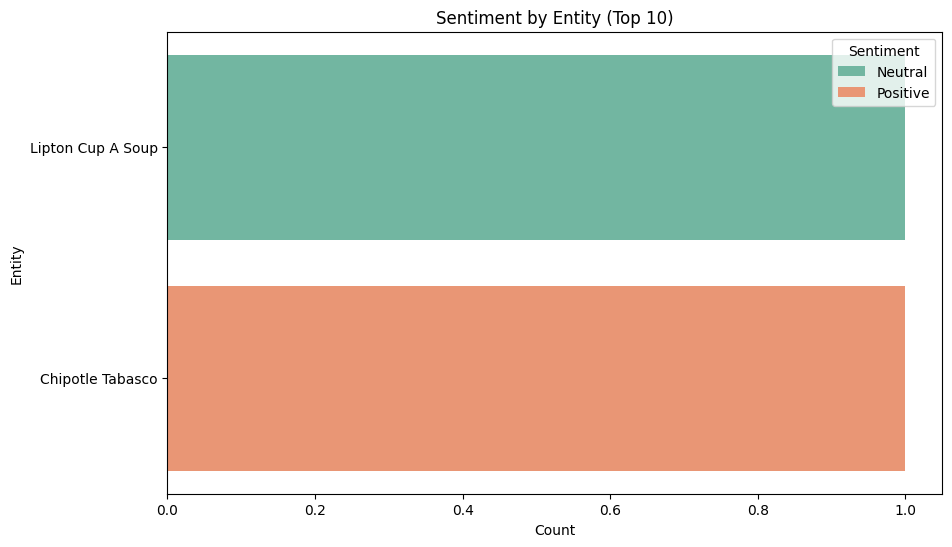
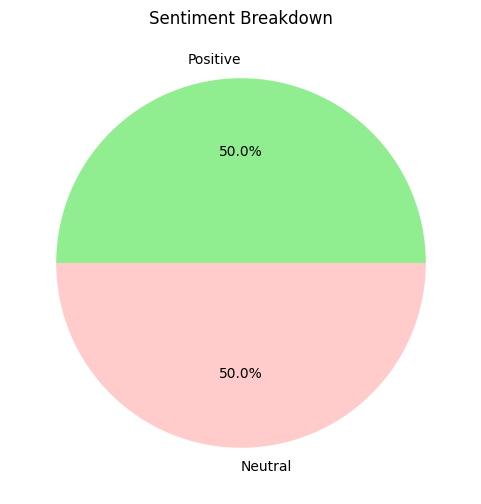
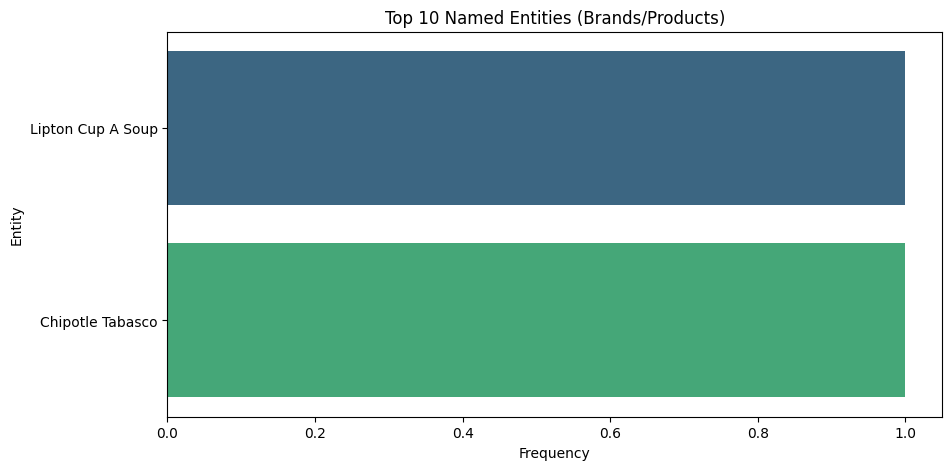
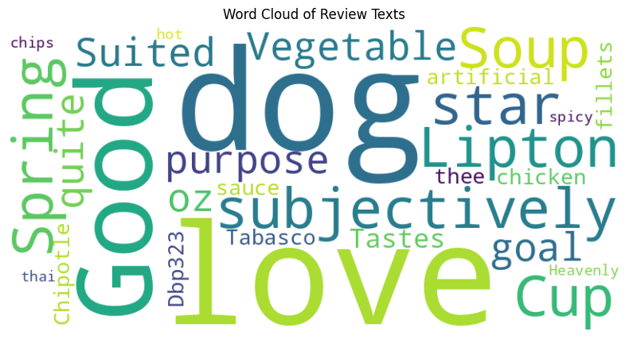

# 🧠 AI Tools Assignment: Mastering the AI Toolkit

## 📘 Overview

This project is a group assignment focused on the real-world application of various AI tools and frameworks. It combines theoretical understanding, practical implementations, and ethical analysis, using tools like **TensorFlow, PyTorch, Scikit-learn, and spaCy**.

**Theme:** *Mastering the AI Toolkit* 🛠️  
**Group Members:** *[Thobeka Jali, Sophia Nakhanu, Jean ]*  
**Submission Platform:** GitHub + LMS Community  
**Tools Used:** Google Colab, Jupyter Notebook, Python

---

## 📌 Assignment Structure

### ✅ Part 1: Theoretical Understanding (30%)

- **Q1:** Comparison between TensorFlow and PyTorch
- **Q2:** Use cases for Jupyter Notebooks in AI
- **Q3:** Advantages of spaCy in NLP
- **Comparative Analysis:** Scikit-learn vs TensorFlow

> 📝 *These answers are compiled in the PDF report attached in the repo.*

---

### ✅ Part 2: Practical Implementation (50%)

#### ⚙️ Task 1: Classical ML with Scikit-learn

- **Dataset:** Iris Species Dataset
- **Goal:** Train a Decision Tree Classifier
- **Metrics:** Accuracy, Precision, Recall
- **Deliverable:** `iris_classifier.ipynb`

#### 🤖 Task 2: Deep Learning with TensorFlow

- **Dataset:** MNIST Handwritten Digits
- **Goal:** Build a CNN with >95% accuracy
- **Highlights:**
  - Convolutional Neural Network built using TensorFlow/Keras
  - Test accuracy > 95%
  - Visualizes predictions for 5 test images
  - Saves and zips output images
- **Deliverable:** `mnist_cnn_classifier.ipynb`

#### 🧾 Task 3: NLP with spaCy

- **Dataset:** Amazon Product Reviews
- **Goal:** Perform Named Entity Recognition (NER) & Sentiment Analysis
- **Highlights:**
  - Extracts product names, brand names using spaCy
  - Rule-based sentiment scoring (positive/negative)
- **Deliverable:** `amazon_reviews_ner_sentiment.ipynb`

---

### ✅ Part 3: Ethics & Optimization (15%)

- **Bias Identification:**
  - Analyzed potential bias in MNIST and Amazon Reviews datasets
  - Suggested tools like *TensorFlow Fairness Indicators* and spaCy rules to mitigate them
- **Debugging Challenge:**
  - Fixed TensorFlow bugs involving shape mismatches and incorrect loss functions
- **Deliverable:** Included in report: `ethical_analysis_and_debugging.pdf`

---

### ⭐ Bonus Task (10%)

#### 📱 MNIST Web App Deployment

- **Tool Used:** Streamlit / Flask
- **Functionality:** Upload handwritten digits and see predictions
- **Deliverable:**
  - Screenshot included in the report
  - [Live Demo Link (if hosted)](https://example.com)

---

## 🖼️ Sample Output Gallery

<p align="center">
  
  
  
  
  
  
  
</p>

> 💡 Additional screenshots and graphs are included in the final PDF report.

---

## 📎 Submission Checklist

- [x] Well-commented Jupyter Notebooks (Colab-ready)
- [x] Final PDF report with theory, screenshots & ethical reflections
- [x] 3-minute presentation video (shared on LMS Community)
- [x] GitHub Repo with code, notebooks, and documentation

---

## 👩🏾‍💻 Getting Started

1. Clone the repository:
   ```bash
   git clone https://github.com/yourusername/ai-tools-assignment.git


2. Open each notebook in Google Colab

3. Follow markdown instructions in each notebook to run and test

## 🤝 Acknowledgements

TensorFlow, PyTorch, Scikit-learn, spaCy

Google Colab (GPU support)

Kaggle & TensorFlow Datasets

[PLP Academy : AI Module]
